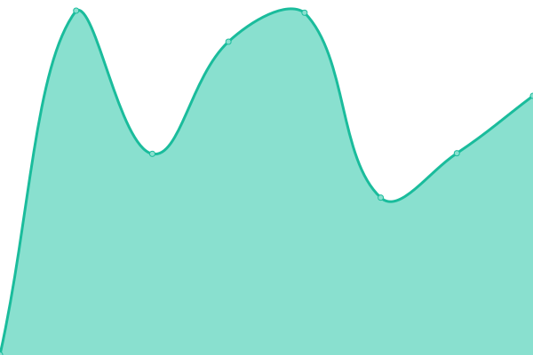
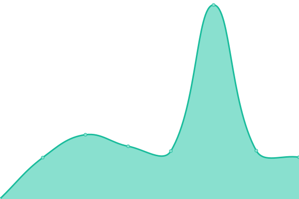
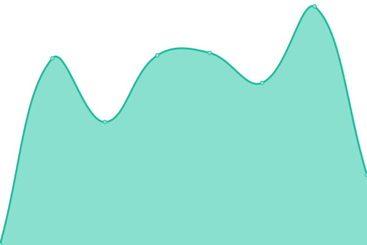
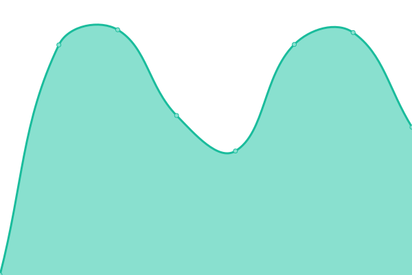

# [📈 Live Status](https://up.needbrainz.com): <!--live status--> **🟩 All systems operational**

This repository contains the open-source uptime monitor and status page for [NeedBrainz](http://www.needbrainz.com), powered by [Upptime](https://github.com/upptime/upptime).

With [Upptime](https://upptime.js.org), you can get your own unlimited and free uptime monitor and status page, powered entirely by a GitHub repository. We use [Issues](https://github.com/needbrainz/websites-upptime/issues) as incident reports, [Actions](https://github.com/needbrainz/websites-upptime/actions) as uptime monitors, and [Pages](https://up.needbrainz.com) for the status page.

<!--start: status pages-->
<!-- This summary is generated by Upptime (https://github.com/upptime/upptime) -->
<!-- Do not edit this manually, your changes will be overwritten -->
<!-- prettier-ignore -->
| URL | Status | History | Response Time | Uptime |
| --- | ------ | ------- | ------------- | ------ |
|  [needbrainz.com](https://needbrainz.com) | 🟩 Up | [needbrainz-com.yml](https://github.com/NeedBrainz/websites-upptime/commits/HEAD/history/needbrainz-com.yml) | 

 767ms
     
 | 

<a href="https://up.needbrainz.com/history/needbrainz-com">100.00%</a>
    

|  [magnetiseur-reiki.ch](https://www.magnetiseur-reiki.ch) | 🟩 Up | [magnetiseur-reiki-ch.yml](https://github.com/NeedBrainz/websites-upptime/commits/HEAD/history/magnetiseur-reiki-ch.yml) | 

 491ms
     
 | 

<a href="https://up.needbrainz.com/history/magnetiseur-reiki-ch">100.00%</a>
    

|  [physio-vd.ch](https://www.physio-vd.ch) | 🟩 Up | [physio-vd-ch.yml](https://github.com/NeedBrainz/websites-upptime/commits/HEAD/history/physio-vd-ch.yml) | 

 528ms
     
 | 

<a href="https://up.needbrainz.com/history/physio-vd-ch">100.00%</a>
    

|  [acu-vd.ch](https://www.acu-vd.ch) | 🟩 Up | [acu-vd-ch.yml](https://github.com/NeedBrainz/websites-upptime/commits/HEAD/history/acu-vd-ch.yml) | 

 463ms
     
 | 

<a href="https://up.needbrainz.com/history/acu-vd-ch">100.00%</a>
    

|  [plausible](https://plausible.needbrainz.com) | 🟩 Up | [plausible.yml](https://github.com/NeedBrainz/websites-upptime/commits/HEAD/history/plausible.yml) | 

 992ms
     
 | 

<a href="https://up.needbrainz.com/history/plausible">100.00%</a>
    

<!--end: status pages-->

[**Visit our status website →**](https://up.needbrainz.com)

## 📄 License

- Powered by: [Upptime](https://github.com/upptime/upptime)
- Code: [MIT](./LICENSE) © [Anand Chowdhary](https://anandchowdhary.com), supported by [Pabio](https://pabio.com)
- Data in the `./history` directory: [Open Database License](https://opendatacommons.org/licenses/odbl/1-0/)
